# 三轴机床 NURBS 轨迹规划与 NSGA-II 多目标优化

[](LICENSE)

一个面向三轴机床 XYZ 路径的 MATLAB 研究项目：从离散路径点出发，完成样条几何拟合、受约束的柔性速度规划、XYZ 运动学评价和 NSGA-II 多目标搜索，并导出可检查的 CSV 与图形。

项目采用两层光顺：几何层使用单位权重五次 B 样条，时间层使用全局七次 B 样条。目标接口为加工时间、双向轮廓误差和振动指标。**当前默认几何权重固定为 1，端点跃度利用率固定为 0，主要可变参数是速度倍率节点**；因此默认情况下轮廓误差通常不随个体变化，实际可探索的权衡主要是时间与振动。

下面的图是项目真实导出的参考结果，输入为 YZ 平面上的正方形，红色离散点与蓝色光顺轨迹用于对照几何拟合效果。

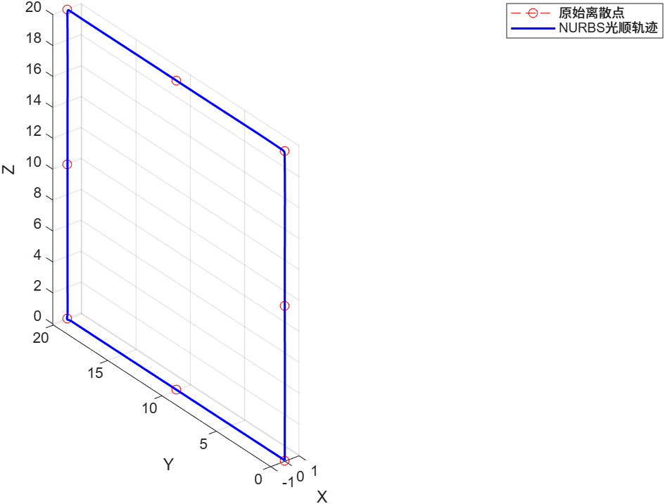

## 导航

- [项目功能与处理流程](#项目功能与处理流程)
- [快速开始](#快速开始)
- [输入路径与配置](#输入路径与配置)
- [优化目标与决策变量](#优化目标与决策变量)
- [输出图片与结果解读](#输出图片与结果解读)
- [CSV 输出文件](#csv-输出文件)
- [常见问题](#常见问题)
- [验证状态与项目结构](#验证状态与项目结构)
- [开源许可](#开源许可)

## 项目功能与处理流程

本项目把“路径形状”和“沿路径如何运动”分开处理。几何拟合控制偏离原始路径的程度，速度规划处理加工时长和运动学约束，NSGA-II 在给定变量范围内寻找非支配候选。

```text
CSV 离散 XYZ 点
  → 输入清理与动态维度选择
  → 五次 B 样条几何拟合、双向轮廓误差评价
  → 弧长重参数化与曲率/几何导数计算
  → 综合局部速度上界
  → LMSC 限速点检测、SPU 速度规划单元划分
  → 七次柔性变速与前后向可达性扫描
  → SPU 内部速度上界和 XYZ 动态约束检查
  → 必要时局部降速、重新规划及整体时间缩放
  → 全局七次 B 样条 S(t) 二次光顺和可行性检查
  → 时间、轮廓误差、振动目标评价
  → NSGA-II 非支配排序、交叉、变异与环境选择
  → 候选目标重算、指定解 CSV/PNG 导出
```

几个术语的含义：

| 术语 | 在项目中的含义 |
|---|---|
| NURBS / B 样条 | 项目保留 NURBS 接口；单位权重配置下几何曲线是非有理 B 样条 |
| LMSC | 局部最小速度约束点，包含需要减速的局部特征和首末边界 |
| SPU | 相邻 LMSC 之间的速度规划单元，用于建立加速、匀速、减速段 |
| 跃度 Jerk | 加速度的一阶时间导数，单位 mm/s³ |
| Snap / Crackle | 跃度的一阶、二阶时间导数，单位分别为 mm/s⁴、mm/s⁵ |
| Pareto 候选 | 依据非支配排序提取的候选；最终选择还应检查其实际约束状态 |
| FRF | 频率响应函数，用配置的模态参数估计不同频率激励的响应 |

速度上界综合考虑指令速度、曲率、可选弦高误差、轴速度、几何跃度和工艺速度；速度倍率节点调节候选上界，不能突破物理上界。路径速度连续并不自动意味着各轴跃度满足约束，因此程序还会检查 XYZ 实际运动量。

算法推导、约束修正细节和历史改动记录见 [docs/ALGORITHM.md](docs/ALGORITHM.md)。本 README 的默认值以当前 [`trajectory_config.m`](SR5NURBS/SR5NURBS/trajectory_config.m) 为准。

## 快速开始

### 1. 获取项目

需要 MATLAB。本项目已在 MATLAB R2026a 中完成文末列出的回归验证。核心流程使用项目自己的样条实现，无需安装原开发目录中的 NURBS、GeoPDEs 或 MATLAB MCP 工具。其他 MATLAB 版本的兼容性尚未逐一验证。

```sh
git clone https://github.com/1resister/NSGA-II-NURBS.git
```

在 MATLAB 中，将当前文件夹设为克隆得到的仓库根目录，再进入源码目录：

```matlab
cd(fullfile('SR5NURBS', 'SR5NURBS'))
addpath(pwd)
```

下文 MATLAB 命令均在这个源码目录中执行。

### 2. 先评价一条参考轨迹

如果想先了解输入和约束是否适合当前路径，可以评价单位权重、单位速度倍率的参考决策，无需先完成遗传优化：

```matlab
cfg = trajectory_config(pwd);
x = cfg.nsga.reference_decision;
result = evaluate_trajectory(x, cfg, true);
disp(result.raw_objectives)
disp(result.constraint)
```

`true` 表示保留完整时间序列。`result.raw_objectives` 是不含罚值的三个目标；`result.constraint` 包含轮廓、路径/XYZ 动态约束和光顺状态。该调用只评价轨迹，不会自动写出全部 CSV 和 PNG。

若希望直接生成这一条参考轨迹的图片，可继续执行：

```matlab
raw = [result.raw_objectives.time, ...
       result.raw_objectives.error, ...
       result.raw_objectives.vibration];
reference_chromosome = [x, raw];
reference_candidates = [1, raw, 1, x];
cfg.output_dir = fullfile(cfg.project_root, 'output', 'reference_demo');
export_results(result, reference_chromosome, reference_candidates, 1, cfg);
visualization(result, reference_chromosome, reference_candidates, 1, cfg);
```

结果写入 `output/reference_demo/solution_001/`。这里人为构造一个单条参考结果的展示表，**没有执行 NSGA-II**；生成的单点候选图不能用于判断优化是否收敛。

### 3. 运行回归与完整优化

```matlab
test_speed_planning(false)  % 合成速度规划用例及相关回归断言
main_function               % 完整 NSGA-II 优化
```

需要检查实际输入路径和临时 Pareto 导出时，可运行：

```matlab
test_speed_planning(true)
```

默认种群规模为 20、迭代次数为 20，是便于尝试的配置。完整计算包含多次轨迹评价，耗时随输入路径、约束和种群规模变化。`main_function` 每次都会启动优化，并清理当前工作区。

### 4. 查看候选并导出所选解

优化完成后会保存 `chromosome_final.txt` 和 `output/pareto_candidates.csv`。默认 `cfg.selection.selected_solution_id = NaN`，因此主入口列出候选后不会自动导出每个候选的图片。

```matlab
candidates = refresh_pareto_candidates();
display_pareto_candidates(candidates);
export_selected_solution(1);
```

从最新候选表的 `solution_id` 列选择编号。编号与最终种群的原始行号不同，也不保证跨运行保持一致。`export_selected_solution(1)` 将当前编号 1 的解写入 `output/solution_001/`。

`refresh_pareto_candidates` 会强制重算候选原始目标；已有有效缓存时，直接执行 `export_selected_solution(1)` 即可复用候选目标并重评价所选解。需要强制刷新并导出时使用：

```matlab
export_selected_solution(1, true)
```

已有最终种群时，使用导出函数即可；再次运行 `main_function` 会重新优化。候选源自罚后目标的非支配等级，展示表显示原始物理目标，**选解后应检查 `constraint_status.csv` 中的 `feasible` 和具体约束状态**。

### 5. 中断后继续计算

```matlab
clear functions
rehash path
resume_optimization
```

检查点默认每 10 代写入 `chromosome_iter.txt`。恢复要求输入路径、变量维度、配置和算法与检查点一致；修改这些内容后，应重新运行 `main_function`。

## 输入路径与配置

### CSV 格式与示例

CSV 至少提供前三列 `X,Y,Z`，使用毫米作为长度单位。输入处理会去除非有限行及相邻重复点；首尾重复可以用于表达闭合路径。

```csv
X,Y,Z
0,0,0
0,10,0
0,20,0
0,20,10
0,20,20
0,10,20
0,0,20
0,0,10
0,0,0
```

| 文件 | 实际内容 |
|---|---|
| [`5stars.csv`](SR5NURBS/SR5NURBS/5stars.csv) | 当前默认输入：YZ 平面上边长 20 mm 的闭合正方形，9 个点，X 恒为 0。文件名沿用旧接口，当前数据不是五角星 |
| [`square_20mm_spacing_1mm.csv`](SR5NURBS/SR5NURBS/square_20mm_spacing_1mm.csv) | 同样的平面正方形，沿边以 1 mm 间距采样，共 81 个点 |

切换输入时，修改 `trajectory_config.m` 中的配置行，例如：

```matlab
cfg.files.input_csv = fullfile(project_root, 'square_20mm_spacing_1mm.csv');
```

输入路径会影响控制点和速度节点数量。建议在配置函数中修改路径后重新获取 `cfg`；只在函数返回后替换输入文件，不会自动重建已确定的动态维度。

### 主要参数及默认值

参数集中在 [`trajectory_config.m`](SR5NURBS/SR5NURBS/trajectory_config.m)。所有速度、加速度、跃度和高阶导数使用毫米、秒组成的单位。

| 参数 | 默认值 | 用途 |
|---|---:|---|
| `cfg.nsga.pop` / `cfg.nsga.gen` | 20 / 20 | 种群规模 / 迭代次数 |
| `cfg.nsga.mutation_probability` | 0.2 | 变异概率 |
| `cfg.nsga.min_unique_chromosomes` | 10 | 保持种群中不同染色体的最低数量 |
| `cfg.interpolation.Ts` | 0.002 s | 时间序列采样周期 |
| `cfg.constraints.max_contour_error` | 0.15 mm | 双向轮廓误差上限 |
| `cfg.limits.Vmax` | 500 mm/s | 路径指令速度上限 |
| `cfg.limits.Amax` / `cfg.limits.Acmax` | 10000 / 10000 mm/s² | 路径加速度 / 法向加速度上限 |
| `cfg.limits.Jmax` | 200000 mm/s³ | 路径跃度上限 |
| `cfg.limits.xyz_vmax` | [500 500 500] mm/s | XYZ 轴速度上限 |
| `cfg.limits.xyz_amax` | [10000 10000 10000] mm/s² | XYZ 轴加速度上限 |
| `cfg.limits.xyz_jmax` | [200000 200000 200000] mm/s³ | XYZ 轴跃度上限 |
| `cfg.limits.xyz_smax` | [7000000 7000000 7000000] mm/s⁴ | XYZ Snap 参考上限 |
| `cfg.constraints.enable_xyz_snap_limit` | false | 是否把 Snap 作为硬约束 |
| `cfg.speed.enable_chord_constraint` | false | 是否启用弦高误差速度限制 |
| `cfg.speed.enable_global_time_scaling` | true | 局部修正后是否允许整体时间缩放 |
| `cfg.time_smoothing.enabled` | true | 是否启用全局七次时间样条 |
| `cfg.time_smoothing.apply_during_objective` | true | 目标评价也采用时间光顺，保持选解与导出一致 |
| `cfg.lmsc_jerk_boundary.enabled` | false | 共享端点跃度功能开关 |
| `cfg.pareto.max_time_ratio` | 10 | 候选时间不超过最短候选时间的指定倍数 |

**软目标和硬约束的开关独立。** 默认 Snap 硬约束关闭，但 Snap 仍参与振动指标计算并导出；共振目标默认开启，模态频率配置为 X=45 Hz、Y=3 Hz、Z=78 Hz，而响应 RMS 上限为 `[Inf Inf Inf]`，未设置有限响应硬上限。这些模态值是项目中的配置示例，使用自己的机床时应替换为相应的模态数据。

## 优化目标与决策变量

### 三个目标怎样计算

| 目标 | 定义及解读 |
|---|---|
| `Time` | 最终时间轴的末值，单位 s，越小表示完成路径越快 |
| `Error` | 原始离散点到连续光顺曲线的投影距离，以及光顺曲线采样点到输入折线距离的较大值，单位 mm |
| `Vibration` | XYZ 跃度 RMS、可选峰值项、Snap、Crackle 和配置共振项组成的综合指标，越小表示这些运动指令指标越低 |

几何误差通过曲线投影和采样评价，不应把它理解为对任意连续位置误差的解析证明。振动指标用于比较运动指令，并非机床实测振动位移或加工质量的直接测量。

设各轴跃度为 $J_i$、轴权重为 $w_i$，组合跃度 RMS 为：

$$
R_J = \sqrt{\sum_{i\in\{X,Y,Z\}} \left(w_i\sqrt{\operatorname{mean}(J_i^2)}\right)^2}
$$

项目使用的综合振动目标为：

$$
V = R_J + w_{peak} P_J + w_{snap}T_s R_{Snap}
    + w_{crackle}T_s^2 R_{Crackle} + V_{resonance}
$$

其中 $P_J$ 是加权 XYZ 跃度矢量模的时间峰值，$R_{Snap}$、$R_{Crackle}$ 按同样的轴权重合成；共振项由 [`machine_resonance_metric.m`](SR5NURBS/SR5NURBS/machine_resonance_metric.m) 计算。默认轴权重 `[1 1 1]`、峰值权重 0、Snap 权重 0.10、Crackle 权重 0.02。峰值权重为 0 不会关闭 XYZ 跃度硬约束。

NSGA-II 内部目标包含违反约束的罚值；候选表和最终选解图展示重评价得到的 `raw_objectives`。比较真实时间和振动时，使用原始目标及约束状态，避免直接把罚后目标当作物理量。

### 染色体的组成

| 部分 | 数量 / 范围 | 默认实际作用 |
|---|---|---|
| 几何权重 | 控制点数动态选择，通常在 12～60；权重固定 [1,1] | 保留 NURBS 接口，默认几何不随种群个体改变 |
| 速度倍率节点 | 数量动态选择，通常在 7～25；倍率 [0.6,1.8] | 经 PCHIP 插值改变沿弧长的候选速度上界 |
| 端点跃度利用率 | 1 个槽；当前范围 [0,0] | 兼容共享端点跃度方案，默认关闭 |

动态维度在启动时按路径复杂度和几何误差目标确定，优化期间保持固定。本 README 的正方形参考解有 24 个几何控制点、9 个速度倍率节点和 1 个兼容槽，共 34 个决策槽，其中 9 个速度倍率是默认可变的部分。

固定几何时，不同候选可能具有相同轮廓误差；若局部物理限速主导规划，不同速度倍率也可能得到相同最终轨迹。此时 Pareto 图出现重叠点是需要结合配置分析的结果，增加种群规模并不保证自动得到明显分离的三个目标。

## 输出图片与结果解读

### 示例来源与数值摘要

以下 12 张 PNG 来自 **2026-08-27 同一次 `solution_001` 参考解导出**，以原图保存。几何权重和速度倍率均为 1，端点跃度利用率为 0。它们用于说明如何读结果，没有作为本次新运行完整优化后的结果，也不代表全局最优性能。

图片位于 [`docs/images/square-example/`](docs/images/square-example/)，对应的小型结果摘要和来源说明位于 [`docs/examples/square-reference/`](docs/examples/square-reference/)。重新运行当前代码会生成新的输出；由于随机优化、输入和配置的影响，不保证产生完全相同的候选数值。

| 指标 | 此参考解结果 |
|---|---:|
| 输入路径 | YZ 平面 20 × 20 mm 闭合正方形 |
| 光顺路径弧长 | 约 79.940900 mm |
| 总时间 `Time` | 79.251657 s |
| 双向轮廓误差 `Error` | 0.080970 mm，小于配置上限 0.15 mm |
| 振动综合指标 `Vibration` | 0.231565 |
| 实际路径最大速度 | 约 2.114722 mm/s |
| 整体时间缩放因子 | 约 103.160017 |
| LMSC / SPU 数量 | 6 个限速点（含首尾）/ 5 个规划单元 |
| 时间光顺 | 被接受，光顺评分改善约 0.238% |
| 约束记录 | 轮廓、路径及 XYZ 速度/加速度/跃度检查通过 |

总时间较长，与该参考解的尖角几何、局部限速和较大的整体时间缩放有关。500 mm/s 是指令上限，不能据此推断实际轨迹会达到该速度。分析加工效率时，需同时查看误差要求、几何导数、局部限速以及时间缩放。

图中 `S` 为弧长，单位 mm；`time` 为时间，单位 s。速度、加速度、跃度和 Snap 的单位分别为 mm/s、mm/s²、mm/s³、mm/s⁴。

### 1. 几何轨迹：原始点与光顺曲线

见 README 开头的 [`trajectory.png`](docs/images/square-example/trajectory.png)。红色圆点和虚线表示输入折线，蓝色实线表示拟合曲线。观察转角附近的偏离程度以及首末位置；参考解的双向误差约 0.080970 mm。

输入的 X 坐标恒为 0，因此曲线落在 YZ 平面内。闭合几何输入仍按有限时间的一次遍历处理，运动的起终点采用零速度边界，不能仅凭首尾位置相同判断它是周期连续运动。

### 2. 曲率：哪些位置会产生限速

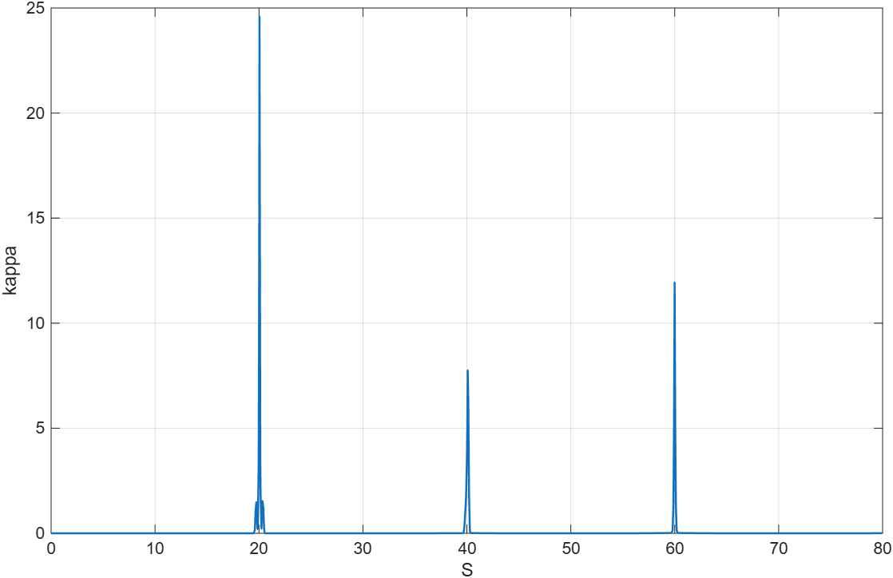

横轴为弧长 `S`，纵轴为曲率 `kappa`（1/mm）。直线段接近零，约 `S=20、40、60 mm` 的内部转角附近出现明显峰值。曲率峰值意味着路径方向快速变化，是曲率速度约束以及相关几何动态约束的重要位置。

曲率连续并不意味着曲率数值很小；保持较小轮廓误差的尖角拟合仍可能产生很高、很窄的曲率峰。需要把本图与下图的速度谷值一起观察。

### 3. 速度约束：上限、修正与实际速度

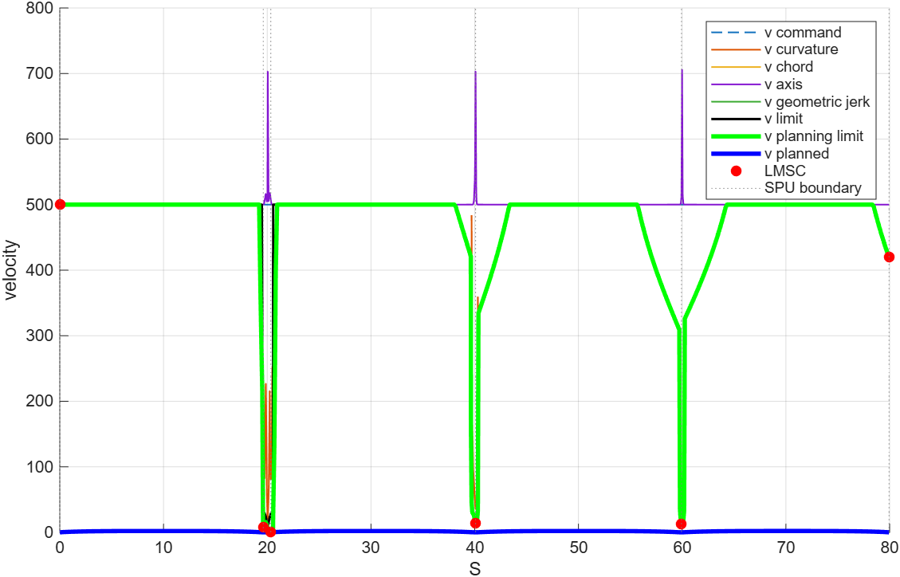

横轴仍是弧长，纵轴是速度。图例中的主要曲线为：

| 图例 | 含义 |
|---|---|
| `v command` | 指令速度上限 |
| `v curvature` / `v chord` | 曲率 / 可选弦高误差速度上限 |
| `v axis` / `v geometric jerk` | 轴速度 / 几何跃度速度上限 |
| `v limit` | 物理综合速度上界 |
| `v planning limit` | 加入速度倍率、动态修正后供规划使用的上界 |
| `v planned` | 最终实际规划速度，蓝色粗线 |
| 红色 LMSC 标记 | 局部限速特征点的约束值 |
| 灰色竖虚线 | SPU 边界 |

转角附近的限速谷值与曲率峰相对应。绿色线是规划上界，蓝色线是最终速度，两者不能混同；此例整体时间缩放较大，所以蓝线远低于 500 mm/s 的指令上限。LMSC 的首尾标记表示约束点，实际起终点速度为零，应从时间曲线和 CSV 判断。

部分约束只在低于指令上限、能够起限制作用的区间绘制；曲线未出现不一定意味着该约束未配置。

### 4. 路径速度：沿轨迹前进多快

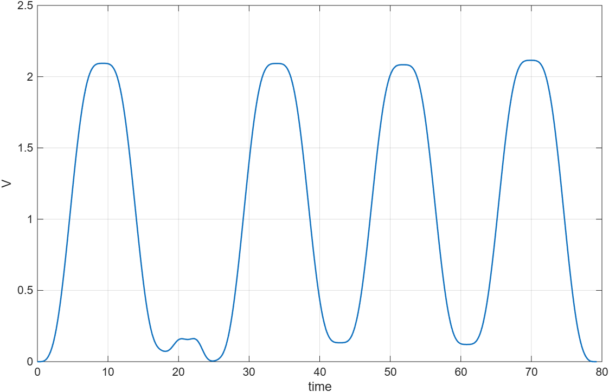

`V(t)=dS/dt` 是沿整条路径前进的标量速度。四个主要速度隆起对应四条边上的运动，转角附近明显减速；起终点速度为零。该图速度保持非负，与 XYZ 某个轴向负方向运动时出现负轴速度是不同概念。

本参考解最大路径速度约 2.114722 mm/s、总时长约 79.251657 s。读性能数据时应使用这种实际运动量，而不是只看配置的最大速度。

### 5. 路径加速度：加速和减速如何衔接

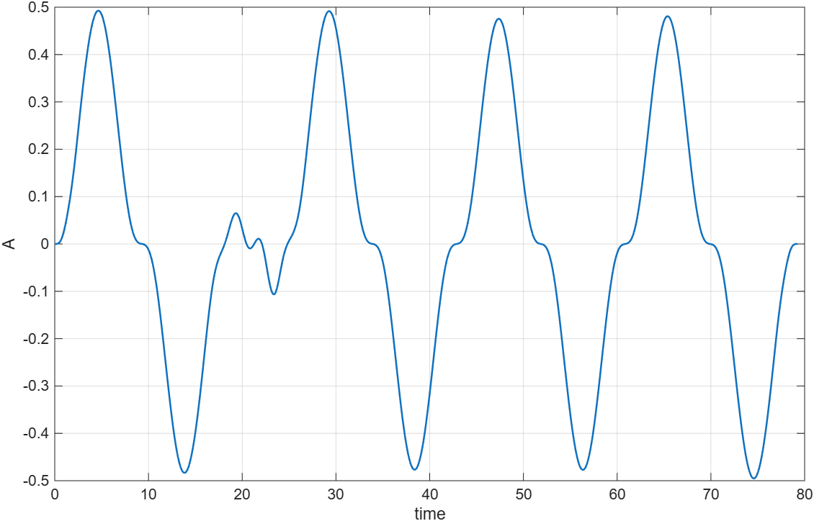

正值对应沿路径加速，负值对应减速；每个主要运动区间都有相应的正负变化。应重点检查是否存在突然跳变，以及与速度变化是否一致。本图反映路径标量加速度，各轴加速度还包含几何方向变化产生的项。

### 6. 路径跃度：加速度变化的速度

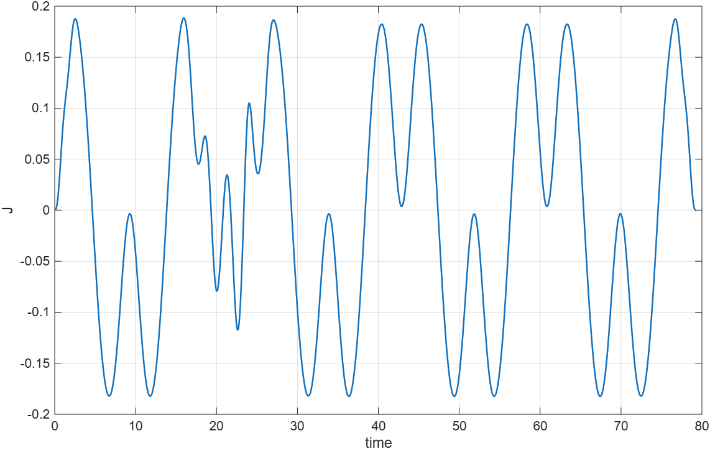

跃度 `J(t)=dA/dt` 描述加速度变化。柔性变速和时间光顺的目的之一是控制这些变化；曲线有正负波峰是正常现象，不能要求整段跃度恒为零。也不能只用本图判断各轴跃度都满足上限，需继续看 XYZ 跃度和约束摘要。

### 7. XYZ 速度：运动方向如何分配到各轴

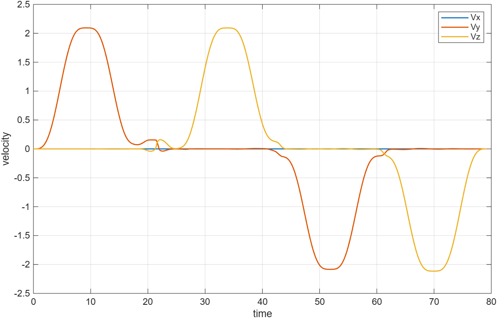

蓝、橙、黄曲线分别表示 X、Y、Z 轴速度。X 轴为零，是因为输入及拟合轨迹位于 YZ 平面。Y、Z 速度的正负变化表示沿正方形不同边向不同方向运动；轴速度为负并不表示路径弧长倒退。

### 8. XYZ 加速度：方向变化带来的轴动态

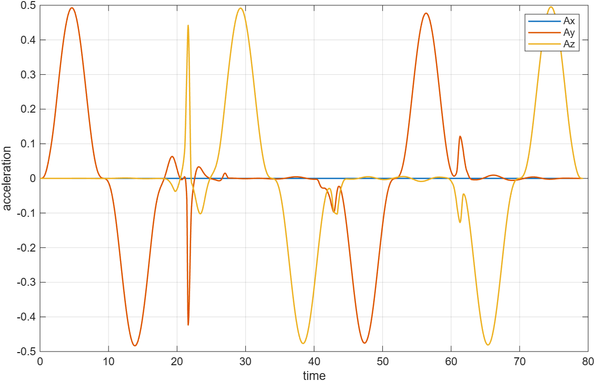

各轴加速度与路径加速度不同。若轴坐标为 `q(S)`，则：

```text
q_dot   = q_S * V
q_ddot  = q_SS * V² + q_S * A
q_dddot = q_SSS * V³ + 3 * q_SS * V * A + q_S * J
```

转角处的几何导数使轴运动量出现局部变化，即使路径标量加速度较平缓，也需要检查 Y、Z 轴的动态约束。

### 9. XYZ 跃度：振动指标的主要输入

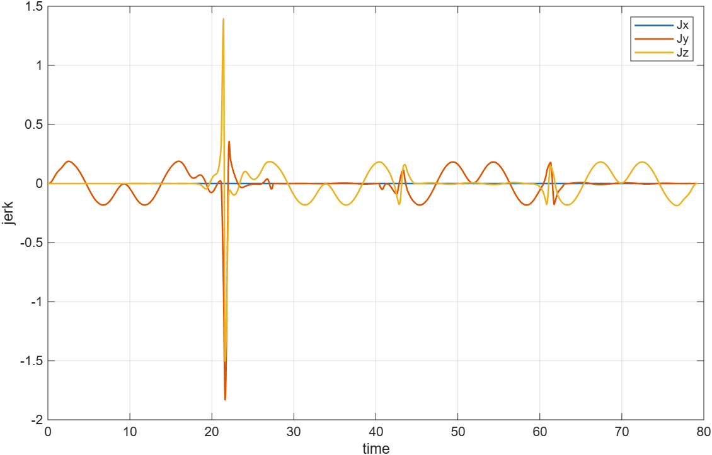

跃度曲线用于计算各轴 RMS、峰值及振动组合指标。此例 Y、Z 轴跃度 RMS 分别约为 0.144428 和 0.139037 mm/s³，组合跃度 RMS 的平方贡献约为 51.90% 和 48.10%；完整振动目标还包含 Snap、Crackle 和共振项。

局部尖峰应结合 `jerk_components.csv` 分析其几何项、耦合项和切向项。未采用全局时间样条时，XYZ 跃度图会补充七次段的精确连接时刻；本参考解已采用全局时间样条，图与 CSV 使用对应的时间采样序列。不能把画线较平滑当作约束证明。

### 10. XYZ Snap：高阶变化与参考边界

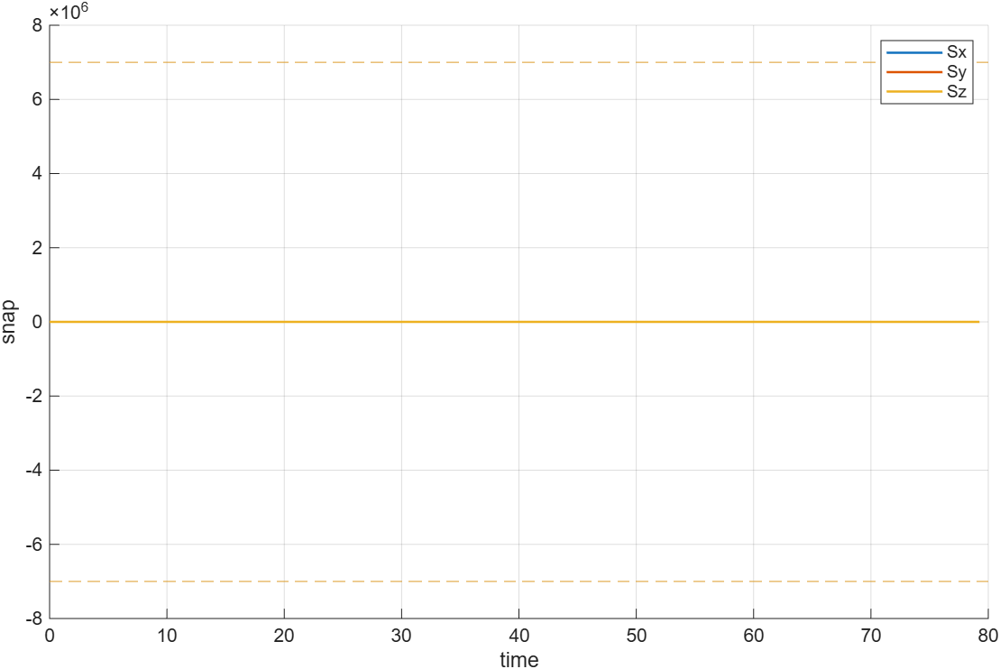

虚线是配置中的正负 Snap 上限。本例最大 XYZ Snap 约为 22.483509 mm/s⁴，相对于 ±7,000,000 的显示范围很小，因此曲线看起来几乎贴着零线，**不表示 Snap 数值恒为零**。

本例 Snap 硬约束关闭。图上画出参考边界不等于已经启用该硬约束；是否参与可行性判断，以 `xyz_snap_limit_enabled` 和配置开关为准。

### 11. 共振频谱：指令在哪些频率上有能量

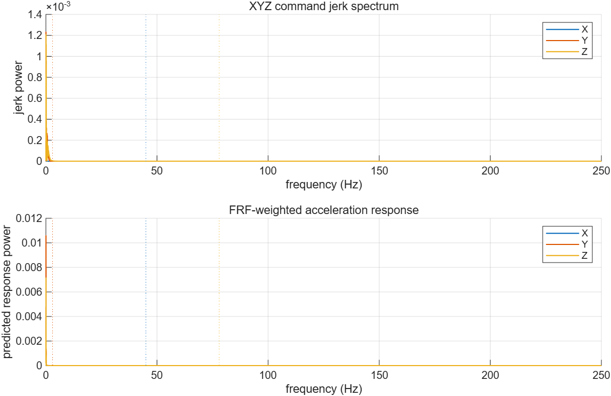

上半图为 XYZ 运动指令的跃度功率谱，下半图为配置 FRF 加权后的加速度响应功率谱。竖虚线标记 X=45 Hz、Y=3 Hz、Z=78 Hz 的配置模态频率。读图时关注模态附近是否有能量集中，而不能只看时域峰值。

此例采样周期 0.002 s，对应 Nyquist 频率 250 Hz。图展示的是基于运动指令和配置模型的计算结果，不是加速度传感器的实测频谱。响应 RMS 上限为 `Inf`，因此本例有共振目标/诊断，但没有有限响应硬上限。

### 12. Pareto 图：如何理解选中的候选

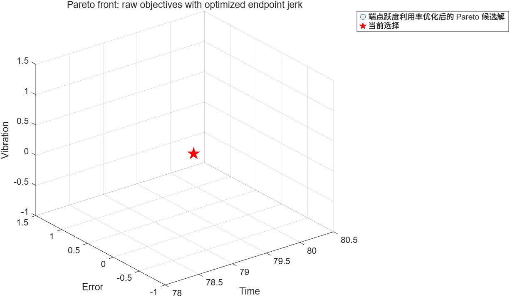

三个坐标是 `Time`、`Error`、`Vibration`，红色星形标记选中的参考解。此批候选表中的 20 个候选具有相同的原始目标三元组，点重合后看起来只有一个点。因此这张图不能用于展示明显分离的时间—误差—振动权衡曲面。

原绘图标题和图例沿用了“optimized endpoint jerk”的文字，但此参考解利用率为 0、共享端点跃度功能关闭；实际状态以对应 CSV 为准。选解时同时比较原始目标和约束，不只看星形标记或图标题。

## CSV 输出文件

完整结果默认写入 `SR5NURBS/SR5NURBS/output/solution_XXX/`。图片适合观察形态，CSV 适合检查数值、处理约束和进行后续分析。

| 文件 | 主要字段 / 用途 |
|---|---|
| `smooth_path.csv` | 光顺后的 `X,Y,Z` 几何路径 |
| `position.csv` | `time,S,X,Y,Z`，时间轴上的位置 |
| `velocity.csv` | `time,S,Vx,Vy,Vz`，各轴速度 |
| `acceleration.csv` | `time,S,Ax,Ay,Az`，各轴加速度 |
| `jerk.csv` | `time,S,Jx,Jy,Jz`，各轴跃度 |
| `jerk_components.csv` | 跃度几何项 `Jg*`、加速度耦合项 `Jcpl*`、切向项 `Jt*` 及合计 |
| `snap.csv` / `crackle.csv` | 各轴跃度的一阶 / 二阶时间导数 |
| `path_motion.csv` | 路径标量速度、加速度、跃度、Snap，不能与 XYZ 分量混用 |
| `curvature.csv` | `S,kappa,radius`，曲率与曲率半径 |
| `speed_constraints.csv` | 各速度约束、候选/规划上界、实际速度及激活约束 |
| `lmsc_points.csv` / `spu_info.csv` | 限速点、单元边界及规划诊断信息 |
| `constraint_status.csv` | 原始目标、误差/动态约束是否通过、时间缩放、时间光顺和共振状态 |
| `vibration_metrics.csv` | 各轴 RMS/峰值/贡献率、Snap/Crackle、共振响应及组合目标 |
| `selected_solution.csv` | 编号、目标、最终种群行号及该解完整决策变量 |
| `exported_solution_objectives.csv` | 候选表目标与选中解重评价目标的一致性 |
| `resonance_spectrum.csv` | 加速度/跃度功率谱、共振权重及响应功率谱 |
| `lmsc_jerk_boundary_*.csv` / `spu_peak_jerk_boundary_values.csv` | 可选共享端点跃度功能的状态、候选及局部边界信息 |

推荐检查顺序：先确认 `constraint_status.csv` 的 `feasible` 和各启用约束，再检查误差及时间缩放，接着查看运动量和振动分量，最后核对 `exported_solution_objectives.csv` 中候选与导出的目标一致性。

`output/pareto_candidates.csv`、`output/pareto_front.csv` 位于所有解共用的输出目录。候选时间过滤默认保留不超过最短原始时间 10 倍的解；设为 `Inf` 可关闭此过滤。候选筛选和编号变更不会删除最终种群中的原始行。

## 常见问题

**为什么输出目录里没有图片？** 默认主入口仅列出候选，因为 `selected_solution_id` 为 `NaN`。优化完成后调用 `export_selected_solution(实际编号)`。首次克隆没有最终种群，需先完成优化；也可以按前面的单条参考轨迹流程生成示例。

**为什么找不到某个解编号？** 使用当前 `pareto_candidates.csv` 的 `solution_id`，不要复用其他路径或旧运行中的编号。筛选规则、种群和配置变化都可能改变编号。

**为什么改了输入后提示染色体维度不匹配？** 维度随路径和误差目标确定，旧 `chromosome_*.txt` 可能属于不同维度。修改配置后重新获取 `cfg` 并重新优化，不要强行补列或截断旧染色体。

**为什么速度上限很高，实际运动仍然很慢？** 指令速度只是其中一个上限。曲率、几何跃度、各轴动态约束及整体时间缩放都可能限制最终速度，先看速度约束图与 `global_time_scale`。

**为什么 Pareto 点重合？** 默认几何权重固定，因此误差不随速度变量变化；局部物理约束还可能使不同速度倍率得到相同最终轨迹。先检查候选表、决策变量、约束和实际运动量，不能只凭图上点数推断个体是否重复。

**为什么共振响应显示为零或没有频谱？** 检查共振开关、模态频率、是否保留频谱以及响应上限。`response_ratio=0` 在上限为 `Inf` 时并不表示预测响应 RMS 为零；具体值见 `vibration_metrics.csv`。

**为什么图片以带时间戳的名字保存？** 目标 PNG 被查看器占用时，导出函数会用带时间戳的备用文件名保存，并给出提示。查看最新文件即可。

## 验证状态与项目结构

2026-10-06 已在 MATLAB R2026a 运行 `test_speed_planning(false)`，8 个合成速度规划用例及相关回归断言全部通过，包括共振指标检查；56 个 MATLAB 源文件的静态检查未发现语法错误。本次公开发布未运行完整 NSGA-II 优化或 `test_speed_planning(true)`。上面的展示图片与数值来自明确标注的历史参考解。

本次 README 改版还实际执行了“先评价一条参考轨迹”中的评价、CSV 和 PNG 导出命令，成功生成 12 张图片，`feasible=1`，时间、误差和振动目标与展示参考解一致。因此可先按该流程检查项目输出，再运行完整遗传优化。

```text
NSGA-II-NURBS/
├── README.md                         使用、配置、目标与图片解释
├── LICENSE                           GNU GPL v3 许可证全文
├── THIRD_PARTY_NOTICES.md             第三方来源及许可声明
├── docs/
│   ├── ALGORITHM.md                  算法细节和历史验证记录
│   ├── images/square-example/         12 张参考解输出 PNG
│   └── examples/square-reference/     图片来源和配套摘要 CSV
└── SR5NURBS/SR5NURBS/
    ├── main_function.m                完整优化入口
    ├── trajectory_config.m            参数、路径和开关
    ├── evaluate_trajectory.m          单条染色体评价
    ├── export_selected_solution.m     按候选编号导出
    ├── test_speed_planning.m          速度规划回归
    ├── test_machine_resonance.m       共振与 Snap 回归
    ├── 5stars.csv                     默认正方形输入
    ├── square_20mm_spacing_1mm.csv     更密采样的正方形输入
    └── output/                        运行时生成，不纳入版本控制
```

本公开仓库包含核心源码、示例输入和文档展示所需的少量图表。完整运行时序、检查点、开发备份、答辩材料、参考论文和工具服务未纳入公开版本。文档中的摘要 CSV 与图片是主动保留的展示资料，运行生成的 `output/` 仍由 `.gitignore` 排除。

## 开源许可

项目新增代码和修改按 **GNU General Public License v3.0 or later**（`GPL-3.0-or-later`）发布。第三方文件保留原作者版权和许可：NSGA-II 基础实现采用 BSD 2-Clause，兼容函数 `findspan.m` 采用 GPL v3 or later。具体文件和完整声明见 [第三方声明](THIRD_PARTY_NOTICES.md)。

欢迎通过 GitHub Issues 提供输入路径、MATLAB 版本、关键配置、错误输出和复现步骤，或通过 Pull Requests 提交改进。
